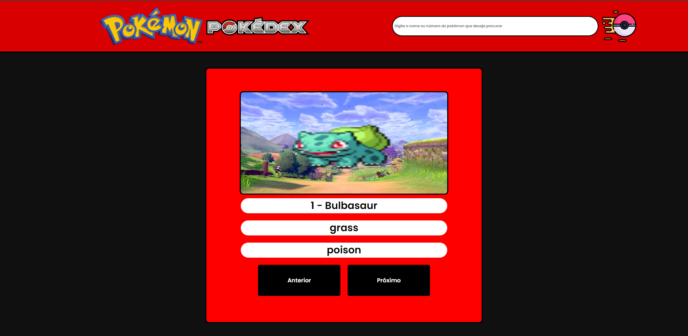

## Projeto de consumo de API com JavaScript

## Soobre o projeto 📖

O projeto foi desenvolvido com o objetivo de consumir uma API de Pokemon, onde ver uma pokedex com todos os pokemons e seus respectivos tipos, aleḿ de poder pesquisar por um pokemon específico.

## Tecnologias utilizadas 🚀

- HTML
- CSS
- JavaScript

<a href="https://andreimartinscoelho.github.io/POKEDEX-JS-JSON/" alt="Uma pequena previa do projeto">LInk do projeto aqui...</a>

## Preview do projeto 📷

